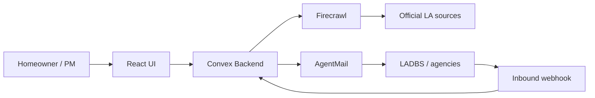

# Greenlight

**Turn a construction project into an executable path to approval.**

Greenlight is an AI permitting agent for Los Angeles residential work (ADUs, garage conversions). It researches official sources, compiles requirements into a live permit graph, tracks blockers, drafts agency correspondence for human approval, and updates the project in real time when agencies reply.

**Live demo:** https://handsome-bison-608.convex.site  
**Repository:** https://github.com/AryanSaxenaa/greenlight  
**Hackathon:** [Convex All Gas Hackathon](https://vibeapps.dev/judging/convex-all-gas-hackathon-openai/submit)

---

## Highlights

- **Compiler pipeline** — Resolves LA jurisdiction, crawls official sources (Firecrawl), extracts requirements, and builds a dependency graph
- **Realtime control room** — Project readiness, compiler stages, sources, documents, and event stream update live via Convex
- **Change impact** — Propose parameter changes (e.g. ADU height) and preview affected requirements before applying
- **Human-in-the-loop email** — AgentMail provisions a project inbox; clarification drafts require approval before send
- **Inbound agency replies** — Webhook ingests replies, classifies decisions, and links extractions to requirements

---

## How it works



1. Sign in and describe your project in plain language with a Los Angeles address.
2. Greenlight compiles jurisdiction, scrapes LADBS / City Planning sources, and seeds the permit graph.
3. Upload evidence (site plans, surveys); facts map to requirements.
4. When a blocker appears, Greenlight drafts a clarification email — you approve before it sends.
5. Agency replies hit the project inbox webhook and update the UI automatically.

---

## Quick start

### Prerequisites

- Node.js 20+
- A [Convex](https://convex.dev) account
- API keys for [Firecrawl](https://firecrawl.dev) and [AgentMail](https://agentmail.to) (for full integration demo)

### Local development

```bash
git clone https://github.com/AryanSaxenaa/greenlight.git
cd greenlight
npm install
cp .env.example .env.local   # fill in values (see below)
npx convex dev                 # terminal 1 — backend
npm run dev                    # terminal 2 — frontend at http://localhost:5173
```

### Environment variables

Put secrets in **`.env.local` only** (never commit). For cloud deploys, also run `npx convex env set KEY value`.

| Variable | Purpose |
|---|---|
| `VITE_CONVEX_URL` | Convex deployment URL (auto-set by CLI) |
| `SITE_URL` / `PUBLIC_SITE_URL` | App URL for auth callbacks and webhooks |
| `JWT_PRIVATE_KEY` / `JWKS` | Convex Auth (PKCS8 key with spaces, not `\n`) |
| `FIRECRAWL_API_KEY` | Scrape and monitor official permit sources |
| `AGENTMAIL_API_KEY` | Provision inboxes and send outbound mail |
| `AGENTMAIL_WEBHOOK_SECRET` | Verify inbound `message.received` webhooks |
| `CLARIFICATION_TEST_RECIPIENT` | Email that receives demo clarification sends |

See [DEPLOY.md](./DEPLOY.md) for production URLs, redeploy commands, and webhook setup.

---

## Deploy

```bash
npx convex dev --once --typecheck=disable   # push backend
npx @convex-dev/static-hosting upload --build  # build + upload frontend
```

Current deployment:

| | URL |
|---|---|
| App | https://handsome-bison-608.convex.site |
| Convex API | https://handsome-bison-608.convex.cloud |
| AgentMail webhook | `https://handsome-bison-608.convex.site/webhooks/agentmail` |

---

## Stack

| Layer | Technology |
|---|---|
| Backend | [Convex](https://convex.dev) — database, functions, file storage, HTTP actions, crons |
| Frontend | React 19 + Vite |
| Hosting | [`@convex-dev/static-hosting`](https://www.npmjs.com/package/@convex-dev/static-hosting) |
| Auth | [`@convex-dev/auth`](https://www.npmjs.com/package/@convex-dev/auth) (password) |
| Scraping | [Firecrawl](https://firecrawl.dev) |
| Email | [AgentMail](https://agentmail.to) |

---

## Project structure

```
convex/           Backend — schema, queries, mutations, actions, HTTP routes
src/              React frontend — pages, components, styles
PlanGreenlight.md Product specification (MVP + demo script §55)
hackathon.md      Public build log
DEPLOY.md         Deployment and webhook reference
```

---

## Demo script (§55)

Verified on the live deployment:

1. Create account → new ADU project at a Los Angeles address
2. Compiler runs → sources scraped, permit graph populated
3. Propose ADU height change → review change impact → apply
4. Approve clarification draft → email sent via AgentMail
5. Agency reply webhook → inbox and event stream update live

---

## Scripts

| Command | Description |
|---|---|
| `npm run dev` | Start Vite dev server |
| `npm run build` | Typecheck + production build |
| `npm run lint` | ESLint |
| `npm run typecheck` | TypeScript check |
| `npm run deploy` | Deploy frontend via static-hosting component |

---

## Documentation

- [PlanGreenlight.md](./PlanGreenlight.md) — full product spec and MVP checklist
- [hackathon.md](./hackathon.md) — build log and commit history
- [DEPLOY.md](./DEPLOY.md) — cloud env vars, redeploy, webhooks

---

## License

MIT — see repository for details.

Built for the Convex All Gas Hackathon. Powered by Convex, Firecrawl, and AgentMail.
