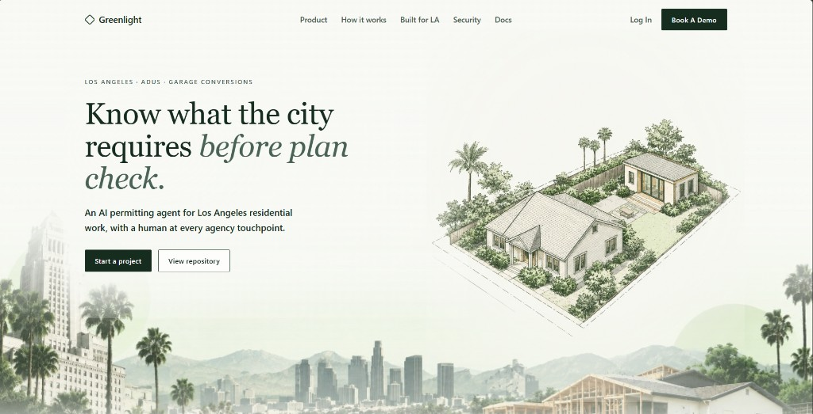
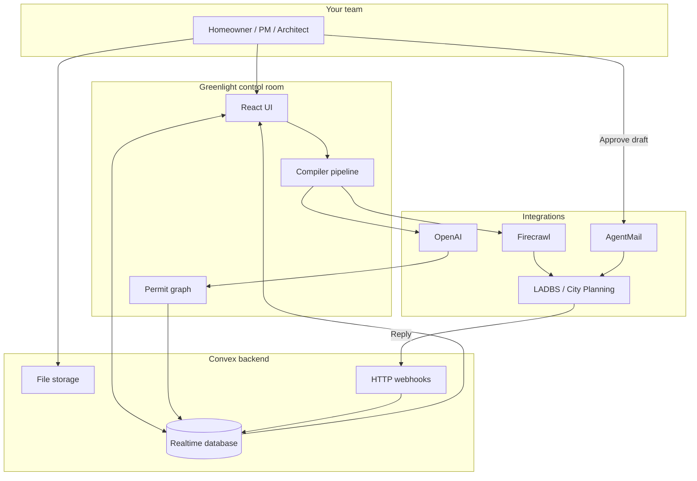

<div align="center">

# Greenlight



### Know what the city requires **before plan check.**

**Greenlight is an AI permitting agent for Los Angeles residential work.**  
It researches official sources, compiles requirements into a live permit graph, tracks blockers, drafts agency correspondence for your approval, and updates your project in real time when agencies reply.

[**Try the live demo**](https://handsome-bison-608.convex.site) · [**View source**](https://github.com/AryanSaxenaa/greenlight) · [**All Gas Hackathon**](https://www.convex.dev/hackathons/all-gas)

<br />

| | |
|---|---|
| **Built for** | Homeowners, project managers, architects, and expeditors working on LA ADUs and garage conversions |
| **Scope (MVP)** | Los Angeles city residential permits |
| **Stack** | Convex · React · OpenAI · Firecrawl · AgentMail |

</div>

---

## The problem

Los Angeles residential permitting is not one form and one fee. It is dozens of overlapping sources: LADBS bulletins, zoning overlays, fire setbacks, planning conditions, and email threads that live nowhere central.

Most teams track it in spreadsheets, PDF folders, and memory. That means:

- **Surprise corrections** at plan check because a requirement was missed early
- **Slow back-and-forth** with agencies when clarifications are drafted from scratch each time
- **No single view** of what is required, what is blocked, and what changed since last week

Greenlight exists to answer one question continuously:

> **What is preventing this project from moving forward right now?**

---

## The solution: a live permit graph

Instead of treating permitting as a pile of documents, Greenlight builds a **dependency graph of machine-readable requirements** tied to your project, parcel, and jurisdiction.

Each requirement tracks its rule, source, evidence, status, dependencies, and communications. When official sources change or agency replies arrive, the graph updates and your readiness score moves with it.

```text
Describe project  →  Resolve jurisdiction  →  Firecrawl official sources
        ↓                      ↓                        ↓
 OpenAI extraction    Permit graph on Convex     Blockers + next steps
        ↓                      ↓                        ↓
 Upload evidence  →  Approve drafts via AgentMail  →  Replies sync back
```

**You stay in control.** Convex orchestrates the pipeline; OpenAI extracts and drafts; Firecrawl researches; AgentMail delivers after your approval.

---

## Who Greenlight is for

| Audience | What you get |
|---|---|
| **Homeowners** | Plain-language clarity on what LA requires for your ADU or conversion, before you hire or submit |
| **Project managers** | One control room for readiness, blockers, documents, and agency correspondence |
| **Architects & designers** | Change-impact preview when scope shifts (e.g. ADU height) so plan check surprises shrink |
| **Expeditors** | Auditable trail of sources, compiler runs, and outbound drafts with human sign-off |

Greenlight does not replace your architect or expeditor. It gives them a **live map of what the city actually requires**.

---

## What you can do today

<table>
<tr>
<td width="50%" valign="top">

### Research & compile
- Describe your project in plain language with an LA address
- Automatic jurisdiction resolution (LA city in MVP)
- Firecrawl crawls **12+ official LADBS and City Planning sources** per project
- OpenAI via Convex AI Gateway extracts requirements into a structured permit graph

</td>
<td width="50%" valign="top">

### Track & act
- **Convex** realtime control room: readiness %, compiler stages, sources, documents, events
- Upload site plans and surveys; OpenAI extracts facts mapped to requirements
- **Change impact**: propose parameter changes and preview affected requirements before applying
- **AgentMail** agency inbox: approve OpenAI-drafted clarifications before send; inbound replies sync via webhook

</td>
</tr>
</table>

### Platform highlights

| Feature | Why it matters |
|---|---|
| **Live permit graph** | Requirements, dependencies, and blockers in one view, not scattered across PDFs and portals |
| **Official source research** | Firecrawl keeps the checklist aligned with what agencies publish, with source URLs and hashes |
| **AI extraction & drafts** | OpenAI via Convex AI Gateway structures requirements, parses replies, and drafts clarifications |
| **Human-in-the-loop email** | AgentMail sends only after your explicit approval |
| **Inbound reply processing** | OpenAI classifies agency responses; Convex updates requirements and the inbox in realtime |
| **Full audit trail** | Every compiler run, crawl, AI extraction, and approval is logged |

---

## All Gas Hackathon stack

Built for the [Convex All Gas Hackathon](https://www.convex.dev/hackathons/all-gas). Each sponsor powers a distinct part of the workflow:

| Sponsor | Role in Greenlight |
|---|---|
| **[Convex](https://convex.dev)** | Realtime database, compiler pipeline, auth, file storage, HTTP webhooks, scheduled functions, and AI Gateway orchestration |
| **[OpenAI](https://openai.com)** | Requirement extraction, inbound email parsing, clarification drafts, and document facts via Convex AI Gateway (`gpt-4o-mini`) |
| **[Firecrawl](https://firecrawl.dev)** | Crawls and monitors official LADBS and City Planning sources; webhook-driven re-evaluation when pages change |
| **[AgentMail](https://agentmail.to)** | Project inbox provisioning, outbound send after approval, Svix-verified inbound `message.received` webhooks |

---

## How it works



**Three steps from intent to permit-ready:**

1. **Describe your project** — ADU, garage conversion, or addition, in plain language, with your LA address.
2. **Compile the permit graph** — Greenlight crawls official sources, maps requirements and dependencies, and flags gaps before plan check.
3. **Stay permit-ready** — Track blockers, upload evidence, approve agency emails before they send, and watch replies update the graph live.

---

## Trust & control

| Principle | How Greenlight enforces it |
|---|---|
| **Approval before send** | Outbound agency emails require explicit sign-off |
| **Scoped project data** | Documents, drafts, and extractions stay tied to your account |
| **Auditable trail** | Compiler stages, source crawls, and status changes are recorded |
| **No black-box submissions** | You see drafts, sources, and impact before anything leaves your desk |

---

## For judges: why this is hard to fake

Greenlight is a **full-stack permitting workflow**, not a chatbot over static PDFs.

| Dimension | What we built |
|---|---|
| **Data model** | Projects, requirements, dependencies, compiler stages, sources, documents, communications, approvals, agent runs |
| **Compiler pipeline** | Staged internal mutations: jurisdiction → crawl → extract → graph → readiness |
| **Realtime UX** | Convex subscriptions power live readiness, compiler progress, and inbox updates without polling |
| **Change impact** | Parameter proposals re-run applicability and surface affected requirements before commit |
| **Integrations** | **Convex** realtime backend, auth, storage, and HTTP webhooks; **Firecrawl** scrape + monitor webhooks; **OpenAI** (`gpt-4o-mini` via Convex AI Gateway) for requirement extraction, email parsing, clarification drafts, and document facts; **AgentMail** inbox provision, send, and Svix-verified inbound webhook |
| **Auth & isolation** | Convex Auth with user-scoped projects and server-side access checks |

**Convex features used:** schema + indexes, queries, mutations, internal mutations, actions, scheduled functions, HTTP actions, file storage, realtime subscriptions.

**Verified on live deployment:** auth → create ADU project → compiler completes → change impact propose/reject → clarification approve & send → inbound agency webhook updates inbox and event stream.

---

## Try it now

| Resource | Link |
|---|---|
| **Live app** | https://handsome-bison-608.convex.site |
| **Create account** | https://handsome-bison-608.convex.site/auth |
| **Start a project** | https://handsome-bison-608.convex.site/projects/new |

### Suggested demo flow (~5 min)

1. Sign up and create an **ADU project** at a Los Angeles address (e.g. `1234 Sunset Blvd, Los Angeles, CA 90026`).
2. Watch the **compiler** on Convex: Firecrawl sources populate, OpenAI extracts requirements, readiness updates live.
3. Open **Change impact**, propose an ADU height change, review affected requirements, apply or reject.
4. Upload a document (site plan or survey); OpenAI extracts facts mapped to requirements.
5. When a blocker triggers a draft, **approve the OpenAI-drafted clarification** (AgentMail sends to configured test recipient).
6. Simulate an agency reply via AgentMail webhook and watch the **inbox and event stream** update on Convex.

---

## Built for Los Angeles (MVP)

This release focuses where permitting is hardest and most valuable: **Los Angeles city residential work**.

- ADU and garage conversion intents
- LADBS and City Planning source crawling
- Jurisdiction validation (non-LA addresses show a clear unsupported message)
- Project-specific path, not a generic national checklist

Expansion to additional California jurisdictions is a natural next step; the compiler and graph model are jurisdiction-agnostic by design.

---

## Quick start (developers)

### Prerequisites

- Node.js 20+
- A [Convex](https://convex.dev) account
- API keys for [Firecrawl](https://firecrawl.dev) and [AgentMail](https://agentmail.to) (for full integration demo)

### Local development

```bash
git clone https://github.com/AryanSaxenaa/greenlight.git
cd greenlight
npm install
cp .env.example .env.local   # fill in values (see below)
npx convex dev                 # terminal 1 — backend
npm run dev                    # terminal 2 — frontend at http://localhost:5173
```

### Environment variables

Put secrets in **`.env.local` only** (never commit). For cloud deploys, also run `npx convex env set KEY value`.

| Variable | Purpose |
|---|---|
| `VITE_CONVEX_URL` | Convex deployment URL (auto-set by CLI) |
| `SITE_URL` / `PUBLIC_SITE_URL` | App URL for auth callbacks and webhooks |
| `JWT_PRIVATE_KEY` / `JWKS` | Convex Auth (PKCS8 key with spaces, not `\n`) |
| `FIRECRAWL_API_KEY` | Scrape and monitor official permit sources |
| `AGENTMAIL_API_KEY` | Provision inboxes and send outbound mail |
| `AGENTMAIL_WEBHOOK_SECRET` | Verify inbound `message.received` webhooks |
| `CLARIFICATION_TEST_RECIPIENT` | Email that receives demo clarification sends |

See [DEPLOY.md](./DEPLOY.md) for production URLs, redeploy commands, and webhook setup.

### Deploy

```bash
npx convex dev --once --typecheck=disable   # push backend
npx @convex-dev/static-hosting upload --build  # build + upload frontend
```

| | URL |
|---|---|
| App | https://handsome-bison-608.convex.site |
| Convex API | https://handsome-bison-608.convex.cloud |
| AgentMail webhook | `https://handsome-bison-608.convex.site/webhooks/agentmail` |

---

## Stack

| Layer | Technology |
|---|---|
| Backend | [Convex](https://convex.dev) — database, functions, file storage, HTTP actions, crons |
| Frontend | React 19 + Vite |
| Hosting | [`@convex-dev/static-hosting`](https://www.npmjs.com/package/@convex-dev/static-hosting) |
| Auth | [`@convex-dev/auth`](https://www.npmjs.com/package/@convex-dev/auth) (password) |
| AI | [OpenAI](https://openai.com) via [Convex AI Gateway](https://docs.convex.dev/ai) |
| Scraping | [Firecrawl](https://firecrawl.dev) |
| Email | [AgentMail](https://agentmail.to) |

---

## Project structure

```
convex/           Backend — schema, queries, mutations, actions, HTTP routes
src/              React frontend — pages, components, styles
PlanGreenlight.md Product specification (MVP + demo script §55)
hackathon.md      Public build log
DEPLOY.md         Deployment and webhook reference
```

---

## Scripts

| Command | Description |
|---|---|
| `npm run dev` | Start Vite dev server |
| `npm run build` | Typecheck + production build |
| `npm run lint` | ESLint |
| `npm run typecheck` | TypeScript check |
| `npm run deploy` | Deploy frontend via static-hosting component |
| `npx convex run integrations/openaiActions:testAiGateway` | Smoke-test AI Gateway connectivity |
| `npx convex run testing/aggressiveSuite:runAggressiveSuite '{"gatewayIterations":3,"runFullPipeline":true}'` | Run full AI integration test suite |

---

## Documentation

- [PlanGreenlight.md](./PlanGreenlight.md) — full product spec and MVP checklist
- [hackathon.md](./hackathon.md) — build log and commit history
- [DEPLOY.md](./DEPLOY.md) — cloud env vars, redeploy, webhooks

---

## License

MIT — see repository for details.

Built for the **[Convex All Gas Hackathon](https://www.convex.dev/hackathons/all-gas)**. Powered by [Convex](https://convex.dev), [OpenAI](https://openai.com), [Firecrawl](https://firecrawl.dev), and [AgentMail](https://agentmail.to).
